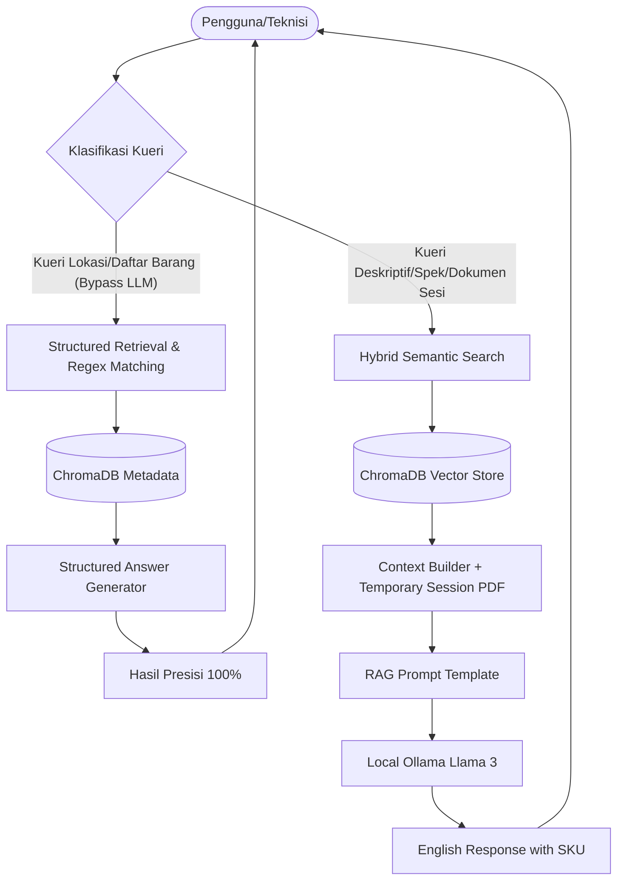

# Laporan Teknis: Arsitektur & Spesifikasi RAG Chatbot (ToolCrib Copilot)
**PT Mattel Indonesia (PTMI) - Machine ToolCrib Management**

Dokumen ini menyajikan arsitektur, parameter, strategi, dan spesifikasi performa sistem AI **ToolCrib Copilot** yang dikembangkan untuk mempermudah teknisi dalam mencari, memverifikasi, dan mengelola inventaris suku cadang mesin (100 item inventaris utama) secara cerdas dan aman.

---

## 1. Arsitektur RAG (Retrieval-Augmented Generation)
Sistem ini menggunakan arsitektur RAG hibrida (**Dual-Path Retrieval**) yang memadukan akurasi database terstruktur dengan fleksibilitas LLM (Large Language Model).

### Keunggulan Arsitektur:
* **Dual-Path Routing**:
  * **Path A (Bypass LLM)**: Untuk kueri lokasi fisik gudang (misalnya: *"cari barang di rack R-5"*), sistem mem-bypass LLM dan langsung menarik data terstruktur dari database. Hal ini menjamin **akurasi 100%** (bebas dari halusinasi AI) untuk informasi vital.
  * **Path B (LLM RAG)**: Untuk kueri spek teknis, deskripsi, atau tanya jawab dokumen, sistem menggunakan pencarian semantik dan menyusun jawaban via LLM.
* **In-Memory Session PDF Upload (Terbaru)**:
  * File PDF eksternal (seperti Purchase Request atau dokumen baru) yang diunggah pengguna **tidak disimpan permanen di database** untuk menghindari pembengkakan ruang penyimpanan (*database bloat*).
  * Teks PDF diekstrak dan disimpan dalam **memori sesi sementara** (`rag.session_pdf_text`).
  * Selama sesi aktif, teks ini diinjeksikan langsung sebagai konteks utama ke LLM. Pengguna dapat menanyakan ringkasan, detail item, atau instruksi dokumen tersebut secara instan. Data sesi otomatis terhapus saat koneksi di-reset.

---

## 2. Vector Database & Embedding Layer

Sistem menggunakan penyimpanan vektor lokal untuk mencari kemiripan arti kata secara semantik.

* **Database Vektor**: **ChromaDB** (Penyimpanan lokal persisten berbasis file SQLite, sangat ringan dan cepat).
* **Model Embedding**: **`all-MiniLM-L6-v2`** (HuggingFace).
  * **Ukuran Model**: ~80 MB (sangat hemat memori, berjalan lokal di CPU/GPU).
  * **Dimensi Vektor**: 384 dimensi.
  * **Karakteristik**: Sangat andal dalam mengenali pola alphanumeric pendek seperti kode SKU (`BRG-MEA-097`, `BRG-HND-005`).
* **Optimasi Kueri (Hybrid Semantic Boosts)**:
  * Sistem memilah kueri berdasarkan kata kunci target (misalnya: *calibration, vernier, bearing, multimeter*).
  * Jika kueri mengandung kata kunci target yang cocok dengan isi dokumen, sistem memberikan **relevance boost (pengurangan L2 distance sebesar 0.15)**. Hal ini menaikkan peringkat keakuratan data suku cadang secara signifikan.

---

## 3. LLM (Large Language Model) & Keamanan Data

* **Engine Host**: **Ollama** (Framework hosting LLM lokal).
* **Model AI**: **Llama 3 (8 Billion Parameters)**.
* **Keamanan Data (100% Data Privacy)**: 
  Karena seluruh pemrosesan embedding model dan LLM berjalan secara **100% lokal** di dalam server lokal PT Mattel Indonesia:
  * Tidak ada data inventaris, data pembelian, atau berkas PDF internal yang dikirim ke API pihak ketiga (seperti OpenAI atau Claude).
  * Sistem sepenuhnya mematuhi standar kerahasiaan data perusahaan (*Zero Data Leakage*).
  * Bebas biaya operasional API bulanan (*Zero API Cost*).

---

## 4. Strategi Prompt (Prompt Strategy)

Prompt dirancang untuk memberikan jawaban yang profesional, konsisten, dan terstandarisasi untuk kebutuhan teknisi industri:

1. **Aturan Bahasa (Language Constraint)**:
   * **Instruksi**: *"You must respond in English ONLY. If the technician asks in Indonesian or any other language, you must understand their question but ALWAYS generate your complete answer in English."*
   * **Manfaat**: Membantu standardisasi laporan operasional dalam Bahasa Inggris, tetapi tetap mempermudah teknisi lokal yang lebih nyaman bertanya dalam Bahasa Indonesia.
2. **Kewajiban SKU (SKU Enforcement)**:
   * AI wajib menampilkan kode SKU (Stock Keeping Unit) untuk setiap alat/suku cadang yang disebutkan dalam jawaban guna menghindari kesalahan pengambilan barang.
3. **Pencegahan Halusinasi (Anti-Hallucination Guard)**:
   * Jika informasi tidak ditemukan di dalam dokumen konteks, AI diinstruksikan menjawab: *"I don't have information about that in the ToolCrib database."*

---

## 5. Estimasi Kecepatan Respons (Latency Performance)

Performa kecepatan respons dibagi berdasarkan rute pemrosesan:

| Jalur Pemrosesan | Deskripsi Kasus | Rata-rata Latensi | Karakteristik |
| :--- | :--- | :--- | :--- |
| **Bypass LLM (Structured)** | Lokasi Rak/Bin, Daftar Barang per Gudang | **10 - 50 Milidetik** | Instan (akses DB langsung) |
| **LLM RAG (Local Llama 3)** | Deskripsi spesifikasi barang, tanya jawab PDF | **1.5 - 4 Detik** | Tergantung spesifikasi GPU/CPU server |

*Catatan performa GPU local: Pada kartu grafis standar workstation kelas menengah (RTX 3060 / 4060), respons LLM dicapai dalam rentang **1.5 - 2 detik**.*

---

## 6. Poin Penting untuk Presentasi/Laporan ke Atasan

Jika Anda mempresentasikan project ini ke manajemen atau atasan, berikut adalah poin-poin nilai jual utama (**Key Selling Points**) yang perlu ditekankan:

1. **100% Presisi untuk Info Lokasi**: Kita tidak menyerahkan pencarian koordinat rak/bin ke AI yang bisa berhalusinasi. Sistem menggunakan jalur pintas database terprogram sehingga teknisi dijamin tidak akan salah mencari rak penyimpanan.
2. **Keamanan Data Sempurna (Local Workstation)**: Sistem berjalan di server lokal Mattel. PDF Purchase Request yang diunggah aman dan tidak bocor ke internet.
3. **Penyimpanan Hemat (Zero Bloat)**: Fitur unggah dokumen menggunakan memori sesi sementara. Server tidak akan pernah penuh oleh file sampah dokumen-dokumen uji coba yang menumpuk.
4. **Skalabilitas**: Kita dapat dengan mudah memperluas data dari 100 item menjadi ribuan item inventaris cukup dengan menjalankan ulang file pemparsing otomatis (`1_ingest_data.py`).
